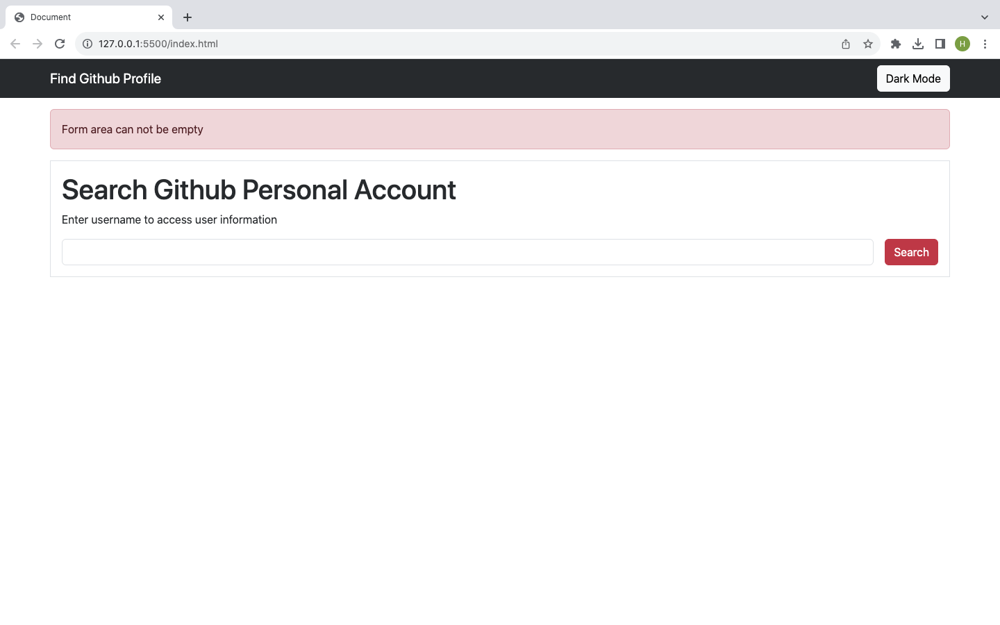
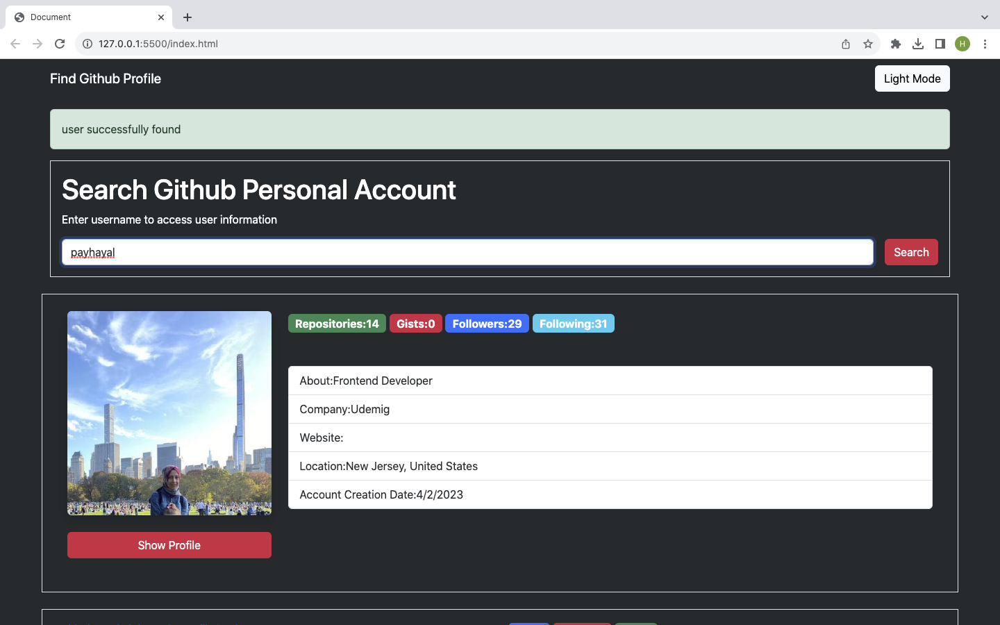

# github-DarkLightMode-ProfileCards

This project was created with HTML, CSS and JAVASCRIPT with github API.

*When you write your username or your friends' name, you can see every detail(the number of following,followers and repos) easily.

*You can use both dark and light mode in this project.

*You can also look into the profile and repos in new tab.

##SCREEN VIEW

##SCREEN GIF

